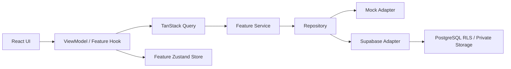

# TABICLIP

SNS·블로그·스크린샷에서 발견한 여행 장소를 잃어버리지 않고 모아 실제 여행 일정으로 연결하는 모바일 우선 서비스입니다. 초기 사용자는 한국을 여행하는 일본인이며, 데이터 모델은 특정 국가에 종속되지 않습니다.

현재 MVP는 여행 생성 → URL·이미지·텍스트 수집 → 장소 정보 수동 확인 → 날짜별 일정 추가 → 오늘의 여행 모드를 하나의 실제 코드 흐름으로 제공합니다. OCR, AI 분석, 소셜 크롤링은 구현된 것처럼 가장하지 않고 로드맵에만 둡니다.

## 구현된 기능

- 일본어 기본·한국어 지원, 모든 제품 URL에 locale prefix 적용
- 이메일 OTP/매직링크 Supabase Auth와 명시적인 mock 로그인 모드
- 여행 목록·생성, 국가/언어/날짜 모델 및 검증
- URL·이미지·텍스트 수집함, 이미지 MIME/10 MiB 제한, 업로드 상태
- 원본을 보며 장소명·번역명·주소·지역·지도 URL을 정리하는 흐름
- 지역별 장소 그룹, 일정 추가, 날짜별 타임라인과 순서 이동
- 오늘 일정, 현지 주소 복사, 외부 지도, 예약 확인을 크게 보여주는 여행 모드
- 예약 생성·조회·수정·삭제 UI
- PWA manifest·아이콘·safe area·online/offline 안내·iOS 설치 가이드
- Supabase migration, RLS, 비공개 Storage 정책, pgTAP 테스트

로드맵에는 OCR/AI, 협업, 교통·영업시간, 전체 오프라인 동기화, Push, Capacitor 앱, 공유 확장, 결제·예약 연동이 포함됩니다.

## 기술 선택

- **Next.js 16 App Router + React 19**: Server Component를 기본으로 사용하고 상호작용하는 leaf만 Client Component로 제한합니다.
- **TypeScript strict + Tailwind CSS 4 + shadcn 스타일 primitive**: 제품 전용 카드/타임라인은 직접 설계하고 Button/Input 같은 접근 가능한 primitive만 재사용합니다.
- **next-intl**: locale route, Server/Client 번역 API, ICU와 locale formatter를 한 경계에서 처리합니다.
- **TanStack Query + Zustand**: 원격 상태와 임시 작업 상태를 분리해 서버 데이터 복사본을 만들지 않습니다.
- **Supabase**: 이메일 Auth, PostgreSQL, private Storage, RLS를 1인 운영 가능한 백엔드 기반으로 사용합니다.
- **Vitest/Testing Library/Storybook/Playwright/pgTAP**: 도메인 규칙부터 모바일 수직 흐름, RLS까지 위험에 맞춘 테스트 계층을 구성합니다.

검토한 안정 조합은 Next.js 16.2.10, React 19.2.7, TypeScript 5.9.3, Storybook 10.5.3입니다. npm의 TypeScript 7/ESLint 10은 당시 Next.js ESLint peer 범위와 맞지 않아 호환되는 최신 안정 메이저(TypeScript 5, ESLint 9)를 선택했습니다.

## 아키텍처



TanStack Query가 여행·수집함·장소·일정·예약을 소유합니다. Zustand에는 이미지 업로드 진행처럼 서버에 저장하지 않는 작업 상태만 둡니다. `tripId`와 locale은 URL이 소유하고, 복잡한 폼은 React Hook Form+Zod가 관리합니다. 커스텀 전역 React Context는 없습니다.

자세한 설계는 [architecture](docs/architecture.md), [state management](docs/state-management.md), [data model](docs/data-model.md)을 참고하세요.

## 디렉터리

```text
src/
├─ app/                    # locale App Router, metadata, route handlers
├─ components/             # product-shared and shadcn-style primitives
├─ features/
│  ├─ auth/
│  ├─ trips/
│  ├─ collection/
│  ├─ places/
│  ├─ itinerary/
│  ├─ reservations/
│  └─ pwa/
├─ i18n/                   # routing, request config, navigation
├─ messages/{ja,ko}/       # domain-split user copy
├─ lib/supabase/           # browser/server clients and row types
└─ shared/                 # date and platform boundaries
supabase/
├─ migrations/
├─ tests/database/
└─ config.toml
e2e/                       # vertical, accessibility smoke, visual tests
docs/                      # architecture, decisions, roadmap
```

## 로컬 실행

필수 환경은 Node.js 24 LTS와 pnpm 11.9입니다.

```bash
pnpm install --frozen-lockfile
pnpm dev
```

`pnpm dev`와 `pnpm build`는 Next.js의 표준 환경변수 로딩을 사용합니다. 실제 Supabase 개발은 `.env.local`을 사용하고, Supabase 없이 UI만 확인할 때는 `pnpm dev:mock`을 사용합니다. Mock 데이터는 메모리 전용이며 새로고침하면 초기화됩니다.

실제 Supabase 모드는 `.env.local`을 만들고 다음 값을 설정합니다.

```dotenv
NEXT_PUBLIC_DATA_MODE=supabase
NEXT_PUBLIC_SUPABASE_URL=https://your-project.supabase.co
NEXT_PUBLIC_SUPABASE_PUBLISHABLE_KEY=sb_publishable_...
NEXT_PUBLIC_APP_URL=http://localhost:3000
NEXT_PUBLIC_APP_NAME=TABICLIP
NEXT_PUBLIC_APP_SHORT_NAME=TABICLIP
```

- `NEXT_PUBLIC_DATA_MODE`: `mock` 또는 `supabase`; 키 누락으로 mock을 추론하지 않습니다.
- `NEXT_PUBLIC_SUPABASE_URL`: 프로젝트 Data API URL.
- `NEXT_PUBLIC_SUPABASE_PUBLISHABLE_KEY`: 브라우저에 공개 가능한 publishable key. service role key를 쓰면 안 됩니다.
- `NEXT_PUBLIC_APP_URL`: 매직링크 callback origin.
- 앱 이름은 가칭 브랜드를 비즈니스 로직에서 분리하는 공개 설정입니다.

## Supabase 로컬 개발

Docker Desktop과 Supabase CLI가 필요합니다.

```bash
pnpm exec supabase start
pnpm exec supabase db reset
pnpm test:db
pnpm exec supabase gen types typescript --local > src/lib/supabase/database.types.ts
```

Migration은 명시적인 Data API 권한과 RLS가 적용된 9개 사용자 데이터 테이블 및 `trip-private` bucket을 생성합니다. `anon`은 애플리케이션 테이블에 접근할 수 없고, `authenticated`는 테이블별 최소 CRUD 권한과 행 정책을 모두 통과해야 합니다. seed는 의도적으로 사용자 데이터를 만들지 않습니다. 실제 로컬 Auth 사용자가 생성될 때 profile trigger가 동작하며, UI mock fixture와 보안 테스트 fixture를 섞지 않습니다.

## 명령어

```text
pnpm dev                 개발 서버(.env.local 사용)
pnpm dev:mock            Supabase 없는 Mock 개발 서버
pnpm build               프로덕션 빌드
pnpm build:mock          Mock 환경 프로덕션 빌드
pnpm start               프로덕션 서버
pnpm lint                warning을 실패로 처리하는 ESLint
pnpm lint:fix            자동 수정 가능한 lint
pnpm typecheck           strict TypeScript
pnpm format              Prettier 적용
pnpm format:check        포맷 검증
pnpm test                Vitest
pnpm test:coverage       커버리지 threshold 포함
pnpm test:e2e            Chromium 390px 수직·시각 흐름
pnpm test:db             로컬 pgTAP RLS 테스트
pnpm storybook           제품 primitive 상태 카탈로그
pnpm build-storybook     Storybook 정적 빌드
pnpm check               lint→typecheck→format→coverage→build
```

## 테스트 상태

- Vitest/RTL: 46 tests passing
- configured business-logic coverage: statements 86.82%, branches 86.48%, functions 82.95%, lines 90.34%
- Next.js production build: passing
- Storybook: 12 product targets/states, static build passing
- Playwright: 2 core/accessibility flows + 4 mobile visual snapshots passing
- pgTAP: 15 Data API grant/owner/member/stranger/Storage RLS assertions authored; 원격 개발 프로젝트에는 `202607210001` migration이 적용됐습니다. 이 작업 환경에서는 Docker Desktop이 실행되지 않아 pgTAP 실행은 확인하지 못했고 전용 CI job에서 실행하도록 구성했습니다.

전역 threshold는 lines/statements 70%, functions 65%, branches 60%입니다. 자세한 범위와 제외 이유는 [testing](docs/testing.md)에 기록했습니다.

## PWA 범위

PWA는 제품의 핵심 마케팅 기능이 아니라 빠른 모바일 배포 전략입니다. 모든 흐름은 설치 없이 웹에서 동작합니다. 현재 service worker는 없습니다. 인증 응답, 예약정보, 사용자 이미지를 잘못 캐시해 stale/private 데이터를 남기는 위험이 더 크기 때문입니다. 향후 명시적인 public shell·암호화 로컬 저장·충돌 정책을 설계한 뒤 도입합니다.

## 보안

- 사용자 데이터 테이블은 RLS가 활성화됩니다.
- 여행 소유자·viewer·editor 권한을 DB 함수와 정책으로 강제합니다.
- 여행 삭제는 owner만 가능하고 owner id는 trigger로 변경할 수 없습니다.
- 사용자 생성 장소는 기본 private입니다.
- 첨부와 예약은 여행 접근 권한을 재사용합니다.
- Storage는 private bucket이며 MIME/크기/경로 소유권과 trip 권한을 함께 확인합니다.
- service role/관리 secret은 클라이언트 환경변수나 코드에 없습니다.
- signed URL은 영구 저장하지 않습니다.

## 설계 트레이드오프

- 커스텀 Context 대신 Query/Zustand/URL/Form의 소유권을 명확히 했습니다.
- 전체 MVVM을 강제하지 않고 복잡한 수집 화면에만 ViewModel hook을 사용합니다.
- 전체 파일 90% 커버리지를 목표로 삼지 않고 핵심 규칙을 높은 밀도로 보호합니다.
- Storybook은 모든 low-level primitive가 아니라 TripCard, PlaceGroup, Timeline, TravelModeCard 같은 제품 상태에 집중합니다.
- service worker를 연기해 오프라인을 가장하지 않습니다.
- mock adapter는 배포 DB가 아니며 데모와 E2E를 위한 결정적 경계입니다.

## 포트폴리오 포인트

- locale-prefixed App Router와 Server/Client Component 경계
- TanStack Query 원격 상태와 feature Zustand 작업 상태 분리
- 동일 repository 계약을 사용하는 mock/Supabase adapter
- 사용자 생성 장소·예약·첨부에 대한 RLS와 private Storage 설계
- 일본어 장문·360–430px·44px touch target을 고려한 모바일 접근성
- UI 숫자용 테스트가 아닌 실제 수직 흐름 E2E와 4개 시각 기준
- PWA와 향후 Capacitor shell 사이의 platform adapter 경계

현재 진행 상태와 다음 3개 작업은 [PLANS.md](PLANS.md), 장기 범위는 [roadmap](docs/roadmap.md)에 있습니다.
