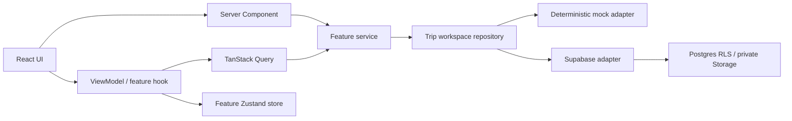

# Architecture

## Context and goals

TABICLIP helps Japanese travelers turn discoveries from URLs, notes, and screenshots into an actionable Korea itinerary. The architecture favors a complete, explainable vertical slice over speculative layers and preserves seams for Supabase and a later Capacitor shell.

## Shape

The project uses feature-first modules. Views import feature public APIs, not database row shapes. A selective ViewModel hook coordinates multi-step interactive screens; simple reads stay in Server Components or query hooks.

## Runtime boundaries

- Server Components render public/static entry screens and stable page shells.
- Client Components own forms, optimistic feedback, browser events, and TanStack Query/Zustand consumers.
- Route handlers/server actions validate external input with Zod before persistence.
- Browser and server Supabase clients are separate. Supabase access remains behind a repository adapter.
- `PlatformService` isolates image picking, share, clipboard, maps, and network status because those differ in a native shell.

## State ownership

| State                  | Owner                       | Examples                                           |
| ---------------------- | --------------------------- | -------------------------------------------------- |
| Durable server state   | TanStack Query + repository | trips, collection, places, itinerary, reservations |
| Multi-component drafts | feature Zustand store       | collection composer, upload queue, itinerary draft |
| Restorable navigation  | route/search params         | locale, trip id, tab, filters                      |
| Complex form state     | React Hook Form             | trip, place, itinerary, reservation forms          |
| Local interaction      | `useState`/`useReducer`     | expanded card, temporary disclosure                |
| Session                | Supabase Auth               | email OTP/magic-link user                          |

No custom business-state React Context is introduced. Translation and Query providers are library requirements, not application state stores.

## Data modes

`NEXT_PUBLIC_DATA_MODE` is mandatory and accepts `mock` or `supabase`.

- `mock`: a deterministic in-memory repository provides a complete demo and browser-test flow without credentials.
- `supabase`: the adapter uses authenticated Supabase clients; PostgreSQL RLS is the final authorization boundary.

The application never infers mock mode from missing credentials.

## Internationalization

Every route begins with `/ja` or `/ko`; `/` redirects to `/ja`. Messages are split by domain and checked for key parity. Domain code returns stable error codes, never translated strings. Server components use server translation APIs; interactive leaves use `useTranslations`.

## UI direction

The visual language is a light travel scrapbook: warm paper background, deep ink text, image-led cards, restrained borders, and one persimmon accent. Cards vary by function instead of repeating one heavy container. Mobile widths from 360–430px are the primary canvas; wider screens cap content width.

## PWA and native path

This release includes installable metadata, icons, safe-area layout, network detection, and offline guidance. It intentionally has no service worker: indiscriminate caching risks stale schedules, reservation details, and authenticated responses. A future service worker must define explicit public-shell and user-data policies first.

The web feature and repository layers remain reusable in Capacitor. Platform adapters will receive native implementations for sharing, image selection, maps, notifications, and network state.

## Dependency rationale

- `next-intl`: locale routing, server/client translation APIs, and ICU formatting.
- `@tanstack/react-query`: server-state lifecycle, mutation invalidation, and testable loading/error states.
- `zustand`: small feature-scoped transient workflow stores without global provider boilerplate.
- `react-hook-form` + `zod`: typed form orchestration and boundary validation.
- `@supabase/supabase-js` + `@supabase/ssr`: official database/Auth/Storage clients with cookie-aware Next.js SSR.
- `lucide-react`: consistent accessible icon primitives.
- `sonner`: compact mutation feedback suitable for mobile.
- `class-variance-authority`, `clsx`, `tailwind-merge`: shadcn-style variant primitives without a second component framework.
- Test-only dependencies provide Vitest/Testing Library, MSW, Storybook, accessibility checks, and Playwright.

## Deliberate trade-offs

- Selective ViewModels avoid both page-sized client components and a ceremonious MVVM layer for simple reads.
- One repository surface groups the vertical trip workspace while its adapters remain feature-aware; it can split if independent scaling needs appear.
- Mock persistence resets on reload by design and is not authoritative product storage.
- Global coverage starts at 70% while core schemas/stores/mappers target 85–90%; this protects behavior instead of rewarding trivial-line tests.
