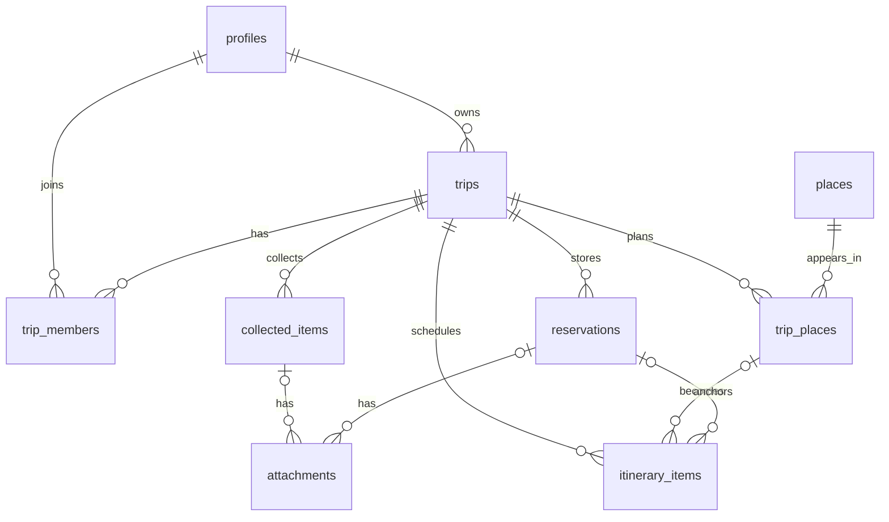

# Data model

## Relationships



Country values use ISO 3166-1 alpha-2 codes and language uses BCP 47-compatible tags; no table assumes Japan or Korea. Status-like values use check constraints because the current value sets are small and migrations can extend them without PostgreSQL enum replacement work.

## Application models versus rows

Generated-style Supabase row types retain snake_case and nullable database fields. Mappers convert them into application-facing camelCase models and attach place display data to itinerary items. UI modules never consume raw rows.

## Data API exposure

The Supabase Data API stays enabled because the browser repository uses `supabase-js`. Automatic exposure for new tables stays disabled. Every migration must explicitly grant only the required table operations to `authenticated`; `anon` receives no application-table privileges. RLS remains a second, mandatory boundary that limits which rows an authenticated role may access. The service role receives explicit CRUD grants for trusted server-side administration and is never exposed to browser code.

## Place visibility

User-created places start as `private`. An authenticated user may read a place when they created it, it is explicitly public, or it is linked to a trip they may access. This avoids leaking personal addresses or accidental drafts while leaving a future curated public catalog possible. Promoting a place to public requires a separate moderation design and is not exposed by this MVP.

## Storage consistency

The private `trip-private` bucket accepts JPEG, PNG, and WebP up to 10 MiB. Objects use:

```text
users/{userId}/trips/{tripId}/collection/{attachmentId}.{ext}
users/{userId}/trips/{tripId}/reservations/{attachmentId}.{ext}
```

RLS verifies both the path owner and trip editing permission. The `attachments` row is the authorization link used for reads. When an attachment insert fails after upload, the adapter removes the object and source row. A production cleanup job should later reconcile rare network failures. Signed URLs are short-lived presentation values and are never stored.

Collection previews use signed URLs that expire after ten minutes. The browser fetches them directly without the Next.js image optimization proxy so a private response is not retained in a shared optimizer cache beyond the Storage authorization window.

## Image policy

The client validates MIME type and size before upload; Storage repeats those constraints. New collection uploads record decoded image dimensions so responsive previews preserve the original aspect ratio. Older attachments without dimensions are measured after their signed image first loads. A future background job may strip EXIF and create responsive variants, but the MVP does not claim optimization or OCR.

## Itinerary place uniqueness

A trip place can belong to at most one itinerary item. Once scheduled, the place card links to that existing item for date, time, and memo edits instead of creating another row. Reservation-only itinerary items remain unaffected because their `trip_place_id` is null.
